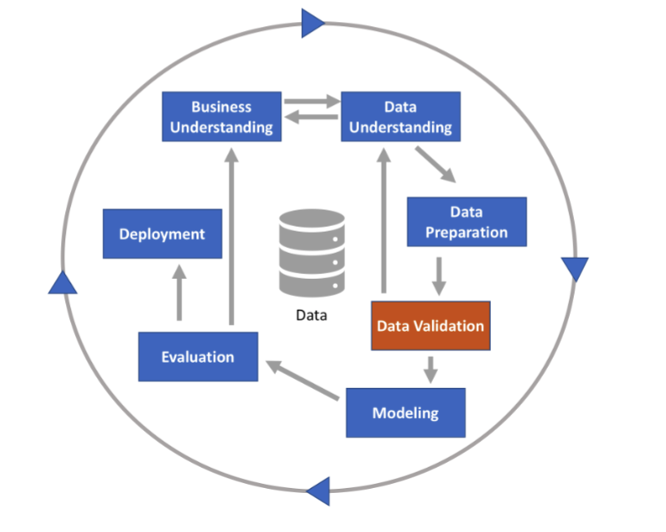
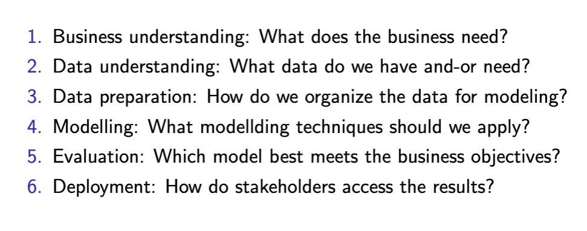

# Apuntes Minería y Análisis de datos

## Intro

### Estimación de decisión sobre de aprendizaje no supervisado

+ Al hacer clustering, se busca la distancia con cierto criterio de optimización.
  + El codo puede ayudar midiendo el nivel que optimiza la hetereogeneidad o el.
  + También la métrica algo silueta midiendo las distancias entre todo el cluster al centro y luego de cada elemento a otros clusters... esperando que sea menor a otros clusters.

### Aprendizaje por Refuerzo:

+ Una agente interactúa con un ambiente (robot o persona) y este toma decisions que optimicen ciertas cosas a pase de recompensas.
+ Se puede generar una matriz sobre las mejores acciones por cierto estado (Esta matriz, Q-table, producto de las x con las y´s).
  + Las y´s que se van encontrando pueden ser vistas como la función de costo. Al ir mejorando o empeorando conforme van cambiando las x´s.

### Problemas no lineales de ML

+ Se proyectan los datos a mayor dimensionalidad que termina siendo equivalente a reducir la dimensionalidad.
+ En caso de poder de cómputo limitado puede hacerse algo, en svm es el producto punto de todas las columnas, para reducir dimensionalidad antes de subrila.

### Hyperparámetros vs parámetros

Los parámetros (ajuste manual) se aprenden con los datos, los hiperparámetros se ajustan.

> $Aprender = Generalizar \ne Memorizar$

Cross validation :)

Regresión y clasificación se puede ver como el mismo problema: buscar el hiper plano (que separe o aproxime).

Siempre primero se busca salir del underfitting y luego se ajusta en caso de haber overfitting.

### Data Leakage (Esteban showing off he's bilingual)

Happens when our training data contains information about the target. This data will not be available at prediction time.

1. Target leakage
   - Predictors are registered after the target variable, e.g., if we include a time-saple as both predictor and target.
   - Predictors contarin (or is the same as) the target variable, e.g., if we include a time-sample as both predictor and target.
2. Train-test contamination
   - Happens when the same point, or a copy of it, exists in both the training and test sets. It might happen in large data bases.

### Datos numéricos

- Cuantitativos
- Positivos o negativos
- Discretos o contínuos

### Datos nominales (categóricos)

- Sin orden
- Nombres, labels, enumeraciones
- Pueden ser números, pero sin significado en sí
- No hay sentido en hacer operaciones sobre de ellos
- One-hot encoding
  - Estos datos no deben usarse (normalmente) directamente en una disminusión de dimensionalidad como el producto punto, pero puede transformarse para convertirlos en un número real
  - Si hay ordinales, sí hay un cierto orden pero habría que considerar que los saltos (como entre chico-mediano-grande) no sisempre son exactos

### Datos ordinales

- Tienen un orden, pero no es exactamente cuantificable. Como chico, mediano y grande.
- Los datos no nos dicen nada sin contexto.

## Teoría de la información

Rama de las matemáticas que nos permite cuantificar la cantidad de información en una señal.

- **Intuición**: Aprendiendo que un evento poco probable que sucede es más informativo que un evento probable que sucede.

  - Por ejemplo: no nos da mucha información la frase "El sol salió en la mañana"; por otro lado, "Hoy habrá un eclipse" sí nos aporta información.
- **Supuestos**:

  - Eventos muy probables dan poca información.
  - Cosas 100% probables no contienen información.
  - Eventos poco probables aportan mucha información.
  - Eventos independientes agregan información.
  - La longitud del mensaje debe ser proporcional a la cantidad de información.
- **Valores muy probables**:

  - Distribución one-hot en los posiblees valores.
  - Baja entropía (Mucho orden)
  - 1 evento --> nada de información
- **Valores poco probables**:

  - Distribución uniforme de los posibles valores.
  - Alta entropía (mucho desorden)
  - 1 evento --> mucha información
- **Posibilidad --> Información**

  - Un evento se ve como variable aleatoria.
  - La información (sorpresa) I(x) para la variable aleatoria x, con probabilidad p(x), se define como  la inversa de la probabilidad:
    - $I(x) = \frac{1}{p(x)}$
  - Si un evento es altamente probable, no hay sorpresa.
  - Si $p(x)=1 \rightarrow I(x)=1$... pero debería ser cero. Para resolver esto, utilizamos el logaritmo natural ya que $ln(1)=0$
    - $I(x) = ln(\frac{1}{p(x)})$
  - Si $p(x)=0 \rightarrow ln(\frac{1}{0})=ln(1)-ln(0)= indeterminado$
  - Normalmente, $ln(.)$ se usa (nats), ó $\log_2(x)$ (Bits)
- **Información mutua**:

  - Lo que podemos decir de $x$ al obervar $y$ o viceversa.
- Entropía: el valor esperado de la información.

  - $H(x) = E[I(x)] = - \sum P(x)log(P(x))$

## KDD

Knowledge Discovery in Data (KDD): is the overall process of collecting data, integrating and processing itm and developing methods and techniques for making sense of such data. What we often call data mining, might also be referred to as KDD, in chich case, Data Mining itself becomes but on step (the core) of the KDD process.

Ciclo:

1. Business understanding: definir el problema, requerimientos del cliente, métricas a optimizar.
2. Data understanding
3. Data preparation
4. Data validation
5. Modeling
6. Evaluation
7. Deployment

### Data analysis

EDA:

- Descriptive statistics: min, max, mean, std_dev.
- Distributions
- Entropy
- Correlations: queremos variables independientes sin correlación entre ellas pero con correlación con $y$.
- Variable selection (feature engineering).

### Deployment

- Visualize and present performance of out best model.
- Develop interpretation.
- Implement in production.
- Design maintainance cycle.

### CRISP-DM

Estandarización del proceso de KDD.

## Scoping

Definir los proyectos. Bien definidos implica mejores chances de ser exitoso. Riesgos si no haces scoping:

- Miscommunication
- Unclear goals
- Lacking of realism
- Impossibility to get data
- Failure

Steps:

1. Goals
2. Actions
3. data
4. Analytics

### Goals

- Define goals as clear as possible.
- Start with rough ideas, and iterate to refine them.
- Set realistic goals.
- Indicate limitations
- Set trade-offs.

### Actions

- After defining goals, set a coourse of actions to chieve them
- Identify those that require data
- Decide which actions need to feed information to other parts of the project
- Establish a flow of information across actions

### Data

- Identify available sources for the data.
- Set quality validation metrics.

### AnALYSIS

- Agree on the type of analysis: description, detection, prediction, classification, regression
- Decide on metrics for evaluation.

### Ethics

- Transparency
- Equity
- Accountability
- Privacy/confidentiality

## EDA

Exploratory Data Analysis

- Getting an overall picture of our data.
- It focuses on looking. at the "position" (mean) and dispersion of each variable (distribution).
- It also looks at the correlation between pairs of variables.
- Data cleaning.

Objective: overview and indentify useful and useless variables.

### Centrality

Location: typical value of a variable:

- Mean: $ \bar{x} =
- Median
- Mode
- Expected vaule: $E[x]=\sum p(x_n)x_n$
- Weighted mean
- Trimmed mean:  $  \frac{1}{n - 2k} \sum_{i=k+1}^{n-k} x_{(i)}$

### Dispersion

Variability of our data:

- STDEV
- Variance
- Mead absolute deviation (MAD): $\text{MAD} = \frac{1}{n} \sum_{i=1}^{n} |x_i - \bar{x}|$
- Entropy: $H(X) = - \sum_{i=1}^{n} p(x_i) \log(p(x_i))$
- Range: $R = \max(x) - \min(x)$
- Quantiles
- Interquartile range

### Distributions

Parametric or non-parametric distributions.

- Parametric: binomial, Gaussian, uniform, other.
- Non-paremetric: kernel density estimation and visualization tools: hacer una gaussiana alrededor de cada punto y sumarlos verticalmente.
- Boxplots, frequency tables, histograms, density plots, scatter plots, etc...
- Biases or anomalies
- Temporal patterns
- Correlations

### Other analyses

Temporalidad, bias, ...

### Binary, categorical, and ordinal variables

- Frequency table for categorical or binned real-valued variables.
- Histogramas: para intervalos de números reales.
- Gráfica de barras: pensadas para valores enteros (tienen espacio entre las barras).
- Mode and expected value.

### Correlations

- Correlation between pairs of independent variables.
- Correlation between each independent variable and the targer variable.
- Visualización:
  - Correlation matric (with p-values)
  - Scatter plots
  - Hexagonal binning chart for numeric data
- P-value

## Feature Selection

Si hay dos variables con alta correlación, quedarse con la que dé más información (o la que esté menos correlacionada con las otras variables).

### Medir correlación

- Numérica vs numérica: correlación
- Numérica vs categórica: ANOVA
- Categórica vs categórica: información mutua

### ANOVA

Supone que las categóricas involucradas tienen la misma medida en la numérica.

Por ejemplo, tasa de "hit" (numérica) por cada posición (categórica).

## Feature Engineering

Lo que queremos:

Approaches:

- Quadratic (or other power transformations): $ x'=(x)^n$
- Square root: $ x´=\sqrt x$
- Logarithmic: $ x' = log(x)$
- Box-Cox transformation:

  $$
  x(\lambda) = 
  \begin{cases} 
  \frac{x^\lambda - 1}{\lambda}, & \lambda \neq 0 \\
  \ln(x), & \lambda = 0 
  \end{cases}
  $$
- Product of initial variables: $x'=(xi)(xj)$
- Product of transformed variables

## Time Series

Dependencia temporal entre eventos.

Tasks: predicción (regresión) (autoregresión si predecimos una variable con la misma pero en el pasado).

Regresión múltiple: cuando usamos otras variables para predecir una en el futuro.

Auteregresión: hasta n muestras en el pasado para predecir el nuevo valor

$$
x(t) = w_o + w_1x(t-1)+w_2x(t-2)+...+w_Nx(t-N)
$$

Regresión múltiple

$$
x(t)=w_{1,1} + x_1(t-1)+w_{1,2}x_1(t-2)+...+w_{1.N}x_1(t-N)+\\+w_{2,1}x_2(t-1)+ w_{2,2}x_2(t-2)+...+w_{2,N}x_2(t-N)+...
$$

Podemos organizar la data con un registro: el independiente (a predecir) y sus variables son los n días anteriores.

Podemos hacer TS con clasificación. Es decir, hacer un modelo para diferentes casos.

### TS EDA

line and scatter plots

Train, Val and Test: Separar por temporalidad.

Convertir a datetime y hacerlo el índice de la tabla.

Estadísticas básicas

Agregar datos faltantes (weekday)

Clipping outliers to min or max of box and whiskers

Hacer correlaciones con lags (te puede dar seasonaility).

Parcial autocorrelation: correlación de la misma variable con k lags descontando la correlación de los lags intermetios.

- Resolver problema de regresión $ x_t = w_0 + w_1x_{t-1}+w_2x_{t-2}+ ...+ w_Nx_{t-n}$
- $ PACF(x_t, x_{t-3}) = w_3$
- $ PACF(x_t, x_{t-N}) = w_n$
- Partial autocorrelation function

Decomposition:

- Base level: base level: average value along the data
- Trend: increment or decrement in the slope of the data
- Seasonality: distinct pattern repeated at regular intervals
- Error: unexplained white noise

### Time Series Models

Moving average:

- Smooths the signal out by using a moving local average of its samples.
- Applicatioins: trend prediction, denoising.
- It relies on a sliding window approach for the computations of the moving average: convolution.
- The window might containg weighs: Weighted moving average.
- Elegir cantidad de datos para el average: k términos con más autocorrelación.

Fourier-based models

- Descomopne una señal en diferentes señales de oscilación perdódica, cuya suma da la señal original.
- Aplication: Fourier Transform for filtering.
- Tool: spectogram for representation: histogram of frequencies of the signals

Exponential smoothing

- Aproxima un moving average by wiethed combinations of historic average approximations and the curreng observations
- $\hat{y_t} = \alpha y_{t-1}+ (1-\alpha)\hat{y_{t-1}} $
- Predicción: el último valor conocido ponderado por el promedio móvil anterior.

Holt-Winters model:

- Es como exponential smooting añadiendo trend y seasonality: $\hat y=l_{t-1}+b_{t-1}+s_{t-m} $ (m es la longitud de la estacionalidad).
- $l_t = \alpha (y_t-s_{t-m})+(1-\alpha

ARIMA family

- $y_t = \phi_1 y_{t-1} + \phi_2 y_{t-2} + \dots + \phi_p y_{t-p} + \varepsilon_t + \theta_1 \varepsilon_{t-1} + \theta_2 \varepsilon_{t-2} + \dots + \theta_q \varepsilon_{t-q}$
- p: número de términos autoregresivos
- d: número de "derivadas" necesarias para estacionalidad.
- q: número de lagged forecast errors.

Facebook Prophet

- Como ARIMA pero procesa:
- Trend, seasonality (Fourier analysis)
- Seasonality pero con Holiday effects
- Información de los dominios.
- Ruido
